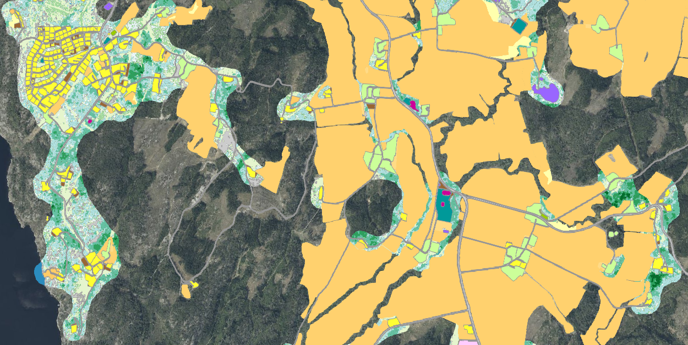

=== Representasjonsform
vektor

=== Datasettoppløsning

{fkbdatasett} egner seg for presentasjon i målestokker fra ca. 1:1000 og mindre.

=== Utstrekningsinformasjon
*Utstrekningbeskrivelse* + 
FKB-Grønnstruktur dekker Norges fastlandsterritorium, men er ikke et heldekkende datasett.
Datasettet dekker bebygde områder inkl. hyttefelt og næringsarealer hentet fra FKB-AR5 og SSB-arealbruk med en 50 meter bred randsone.

SSB Arealbruk og jordbruksareal fra FFK-AR5

image::Halden_ar5jb_ssbarealbruk.png[SSB Arealbruk og jordbruksareal fra FFK-AR5]

SSB Arealbruk og jordbruksareal fra FKB-AR5 inkludert en 50 meter randsone utgjør kartleggingsområdet for grønnstrukturdatasettet

image::Halden_gsk.png[FKB-Grønnstruktur]

Grønnstruktur sammen med SSB Arealbruk og jordbruksareal fra FKB-AR5

=== Identifikasjonsomfang
<<HeleDatasettet,Hele datasettet>>
