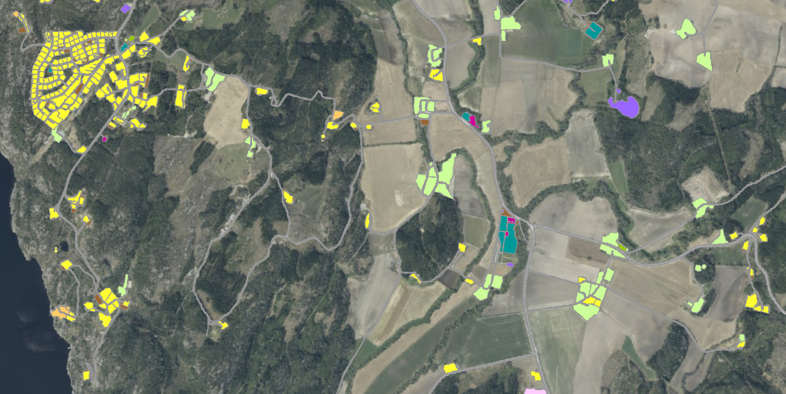
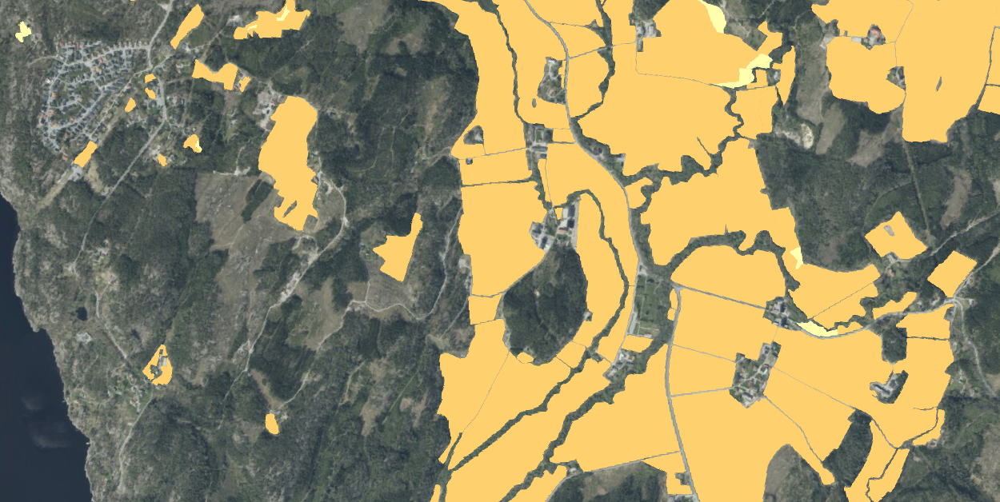
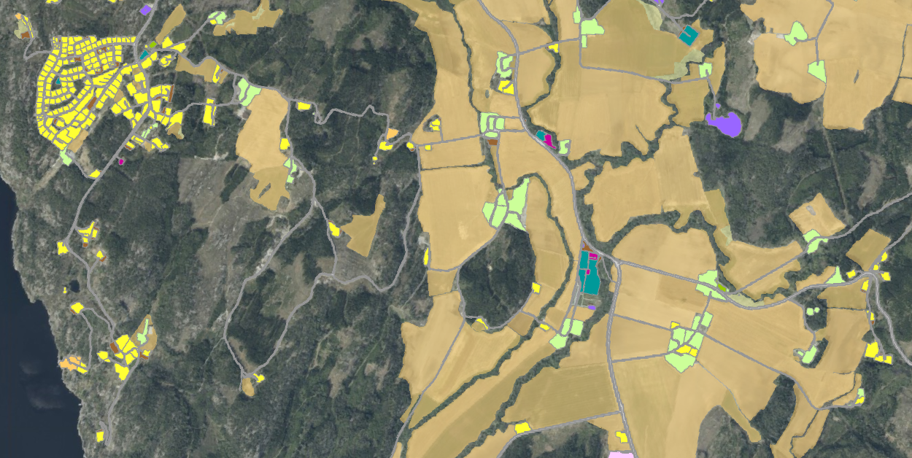

=== Representasjonsform
vektor

=== Datasettoppløsning

{fkbdatasett} egner seg for presentasjon i målestokker fra ca. 1:1000 og mindre.

=== Utstrekningsinformasjon
*Utstrekningbeskrivelse* + 
FKB-Grønnstruktur er et nasjonalt, men ikke heldekkende, datasett. Utgangspunktet er SSBs tettstedsavgrensing med tillegg av bebygde områder fra SSB-arealbruk. Spredte (isolerte) enkelttomter tas ikke med.
Datasettet dekker bebygde områder inkl. hyttefelt og næringsarealer hentet fra SSB-arealbruk med en 50 meter bred randsone. Jordbruksareal fra FKB-AR5 som faller innafor denne 50 meter buffersonen inkluderes.

.SSB-arealbruk

.Jordbruksareal fra FKB-AR5

.SSB-arealbruk og jordbruksareal fra FKB-AR5 (gjort gjennomsiktig).

Bare FKB-AR5-jordbruksareal som faller innafor den 50 meter buffersona tas med i grønnstrukturkartet.

.Grønnstrukturdatasettets kartleggingsområde omfatter bebygde områder inkl. hyttefelt og næringsarealer i SSB-arealbruk med en 50 meter randsone rundt klipt mot jordbruksareal i FKB-AR5.
image::halden_gsk.png[title=FKB-Grønnstruktur]

=== Identifikasjonsomfang
<<HeleDatasettet,Hele datasettet>>
