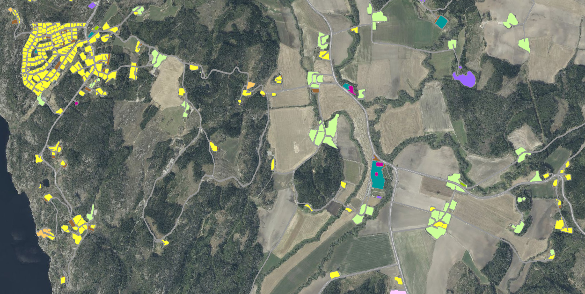
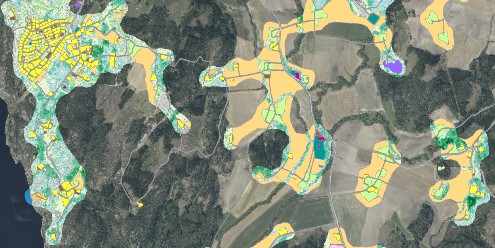

=== Representasjonsform
vektor

=== Datasettoppløsning

{fkbdatasett} egner seg for presentasjon i målestokker fra ca. 1:1000 og mindre.

=== Utstrekningsinformasjon
*Utstrekningbeskrivelse* + 
FKB-Grønnstruktur dekker Norges fastlandsterritorium, men er ikke et heldekkende datasett.
Datasettet dekker bebygde områder inkl. hyttefelt og næringsarealer hentet fra FKB-AR5 og SSB-arealbruk med en 50 meter bred randsone.

image::Halden_gsk.png[FKB-rønnstruktur]

=== Identifikasjonsomfang
<<HeleDatasettet,Hele datasettet>>
