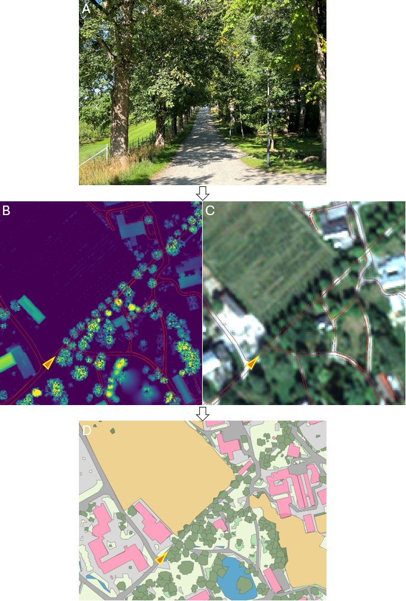

=== Omfang
<<HeleDatasettet,Hele datasettet>>

=== Produksjonsrutine
Fjernmåling er den dominerende datafangstmetoden for {fkbdatasett}. 

Grønnstrukturkartet etableres ved bruk av

* detaljerte offentlige kartdata – bruker til enhver tid alle hensiktsmessige flater
* satellittdata (<<VHR,VHR>>-opptak fra Copernicus-programmet via Norsk Romsenter) med oppløsning 2–4 meter
* høydedata med romlig oppløsning 1 m x 1 m (<<NDH,NDH>>)

Det hentes informasjon fra SSB-arealbruk og FKB-AR5 for å

* avgrense kartleggingsområde (bebygde områder inkl. hyttefelt og næringsarealer ved å kombinere FKB-AR5 og SSB-arealbruk, bufre ut og inn for sammenhengende områder)
* gi informasjon om jordbruksareal i kartleggingsområdet

I tillegg brukes andre hensiktsmessige FKB-datasett for å skille mellom grønne og ikke-grønne områder. Eksempler er FKB-Arealbruk (transformasjonstasjon, industriområde) og FKB-BygnAnlegg (rørgate, demning). Dette er ingen uttømmende liste – FKB-datasett og grunnlagsdata kan endre seg i fremtiden avhengig av tilgjengelighet og økonomi.

I grønnstrukturkartet er Grått definert som områder uten vegetasjon. Den operasjonelle definisjonen av grå arealer er altså at de ikke er grønne arealer. Det vil si arealer hvor NDVI-verdien er under en beregnet terskelverdi. Hva slags materiale det består av, blir ikke forsøkt tolket. Det kan imidlertid gis en liste med eksempler på materialer som vil få lav NDVI og dermed ikke blir tolket som grønne, se <<appgrått,FeatureType Grått>>.